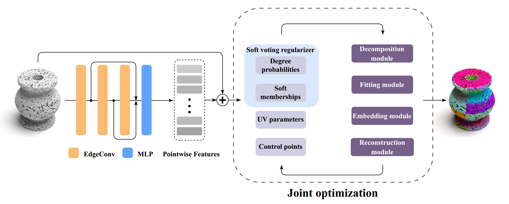

# BPNet

BPNet: Bézier Primitive Segmentation on 3D Point Clouds  ([IJCAI-23](https://www.ijcai.org/proceedings/2023/84))

<div align="center">
  
</div>


### Data Preparation
Please download the pre-processed [ABC dataset](https://drive.google.com/file/d/15u9hpQqurYhzNIZrnCVejCoAYXmr_U8-/view?usp=sharing).

unzip the dataset, and modify the root path in the `options.py`

### Training
configure your training settings in `options.py`, and then:

```python train.py```

### Testing
configure your testing settings in `options.py`, and then:

```python test.py```


